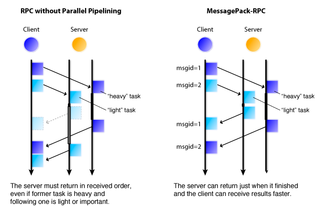
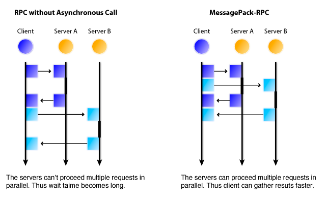

# MessagePack-RPC Specification

## Notice

This page describes the specification of the MessagePack-RPC Protocol, a Remote Procedure Call (RPC) Protocol using MessagePack data format. This information is required for developing the MessagePack-RPC language bindings.

MessagePack-RPC enables the client to call pre-defined server functions remotely. The merits of MessagePack-RPC are as follows.

### Compact

The message between the clients and the server is packed using the MessagePack data format. It's really compact compared to other formats like JSON, XML, etc. and allows to properly pass binary data as such. The network bandwidth can be reduced dramatically.

### Fast

The implementation of MessagePack-RPC is really fast by careful design for  modern hardware (multi-core, multi-cpu, etc). The stream deserialization + zero-copy feature effectively overlaps the network transfer and the computation (e.g. deserialization).

### Packaged

The language bindings of MessagePack-RPC are well packaged, by using the default packaging system for each language (e.g. gem for Ruby).

### Rich

Some client implementation support asynchronous calls. The user is thus able to overlap multiple RPC calls in parallel.

# MessagePack-RPC Protocol specification

The protocol consists of "Request" message and the corresponding "Response" message. The server must send a "Response" message in reply to the "Request" message.

## Request Message

The request message is a four elements array shown below, packed in MessagePack format.

```
[type, msgid, method, params]
```

### type

The message type, must be the integer zero (0) for "Request" messages.

### msgid

A 32-bit unsigned integer number. This number is used as a sequence number. The server's response to the "Request" will have the same msgid.

### method

A string which represents the method name.

### params

An array of the function arguments. The elements of this array are arbitrary objects.

## Response Message

The response message is a four elements array shown below, packed in MessagePack format.

```
[type, msgid, error, result]
```

### type

Must be one (integer). One means that this message is the "Response" message.

### msgid

A 32-bit unsigned integer number. This corresponds to the value used in the request message.

### error

If the method is executed correctly, this field is Nil. If the error occurred at the server-side, then this field is an arbitrary object which represents the error.

### result

An arbitrary object, which represents the returned result of the function. If an error occurred, this field should be nil.

## Notification Message

The notification message is a three elements array shown below, packed in MessagePack format.

```
[type, method, params]
```

### type

Must be two (integer). Two means that this message is the "Notification" message.

### method

A string, which represents the method name.

### params

An array of the function arguments. The elements of this array are arbitrary objects.

# The Order of the Response

The server implementations don't need to send the reply in the order of the received requests. If they receive the multiple messages, they can reply in random order.

This is required for the pipelining. At the server side, some functions are fast, and some are not. If the server must reply in order, the slow functions delay the other replies even if it's execution is already completed.



# Client Implementation Details

There are some client features which client libraries should implement.

## Step 1: Synchronous Call

The first step is to implement the synchronous call. The client is blocked until the RPC is finished.

```java
Client client = new Client("localhost", 1985);
Object result = client.call("method_name", arg1, arg2, arg3);
```

## Step 2: Asynchronous Call

The second step is to support the asynchronous call. The following figure shows how asynchronous call works.



The call function finishes immediately and returns the Future object. Then, the user waits for the completion of the call by calling the join() function. Finally, it gets the results by calling the getResult() function.

```java
Client client = new Client("localhost", 1985);
Future future = client.asyncCall("method_name", arg1, arg2, arg3);
future.join();
Object result = future.getResult();
```

This feature is useful when you call multiple functions at the same time. The example code below overlaps the two resquests, by using async calls.

```java
Client client = new Client(...);
Future f1 = client.asyncCall("method1");
Future f2 = client.asyncCall("method2");
f1.join();
f2.join();
```

Implementing the asynchronous call may require an event loop library. Currently, the following libraries are used.

* C++: [mpio|http://github.com/frsyuki/mpio]
* Ruby: [Rev|http://rev.rubyforge.org/rdoc/]
* Java: [JBoss netty|http://www.jboss.org/netty]

## Step 3: Multiple Transports

The implementation should support multiple transports like TCP, UDP, or UNIX domain sockets, if possible.

# Server Implementation Details

There are many choices on server architectures (e.g. single-threaded, event-based, multi-threaded, SEDA, etc). The implementation may choose one freely.
